# MelisInstaller — Functional & Technical Documentation (for AI)

> **What this is.** MelisInstaller is the platform's **first-run setup wizard**. It walks you from a fresh
> Melis skeleton to a working install: it checks the server (PHP, Apache, vhost, file rights, environments),
> tests the **database connection**, lets you choose a **setup type** and the **modules/site** to install,
> then **downloads** them (Composer), **imports** their tables (DbDeploy), **activates** them, collects
> per-module **configuration** (including the first admin user), and finishes. It is part of the platform
> foundation (§0).
>
> **Two parts:** **[Part A — Functional Guide](#part-a--functional-guide)** ·
> **[Part B — Technical Reference](#part-b--technical-reference)**. Consumed by the **MelisAI** MCP.
> Reviewed 2026-06-10.

---

## 0. The MelisCore platform foundation (this family of modules)

> These modules are the **foundation of the Melis platform** — collectively referred to as **"MelisCore"**.
> *MelisCore* proper is the back-office heart everything depends on; the other four are the infrastructure that
> installs, deploys, serves and migrates the platform.

- **MelisCore** — the **back-office foundation** (login, users/rights, tools framework, dashboard, config,
  events, base services). **Every module depends on it.** → [MelisCore](../../../melis-core/etc/MelisAI/doc/MelisCore.md)
- **MelisAssetManager** — serves module assets & bundles; module discovery. → [MelisAssetManager](../../../melis-asset-manager/etc/MelisAI/doc/MelisAssetManager.md)
- **MelisDbDeploy** — applies database migrations (the “import tables” of the install). → [MelisDbDeploy](../../../melis-dbdeploy/etc/MelisAI/doc/MelisDbDeploy.md)
- **MelisComposerDeploy** — runs Composer from inside the platform to install/update/remove modules. → [MelisComposerDeploy](../../../melis-composerdeploy/etc/MelisAI/doc/MelisComposerDeploy.md)
- **MelisInstaller** *(this module)* — the **first-run installer** wizard that orchestrates all of the above.

**Dependency note:** MelisInstaller requires **MelisCore** and **MelisEngine** (`^5.2`). During setup it drives
**MelisComposerDeploy** (download the chosen packages) and **MelisDbDeploy** (import their tables), then the
modules are activated and **MelisAssetManager** serves their assets.

---
---

# PART A — Functional Guide

The installer is a **left-rail wizard**: *Introduction → 1 System configuration (Apache · Vhost · File system
rights · Environments) → 2 Database connection → 3 Setup type (Selection · Download · Configuration) →
Confirmation.* Each screen validates before letting you continue.

## A1. Introduction

A welcome screen summarising the three milestones — **System configuration**, **Database connection**, **Setup
type** — with a **Let’s start** button.

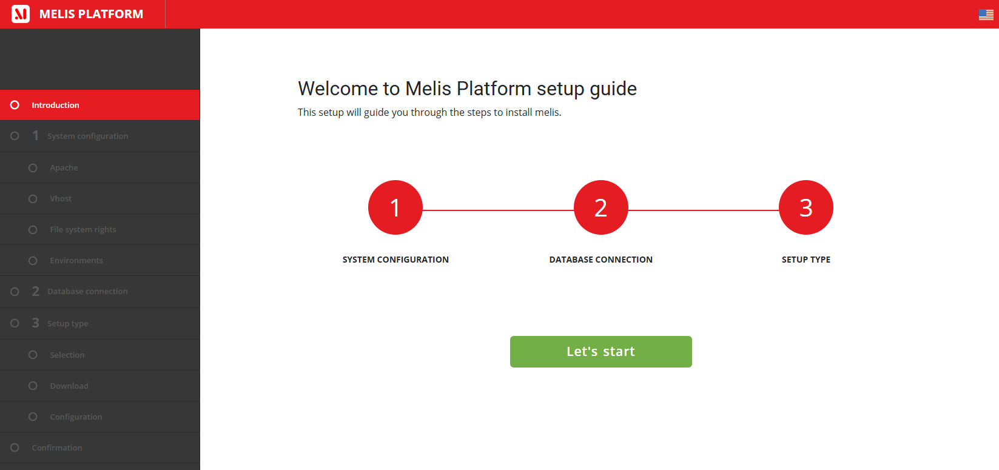

## A2. Step 1 — System configuration

### Step 1: System requirements
Checks your **PHP version** (e.g. *8.3.28*, recommended 8.1) and that the required **PHP extensions** are
present: `openssl`, `json`, `pdo_mysql`, `intl`, `zip` (each ticked green when found).

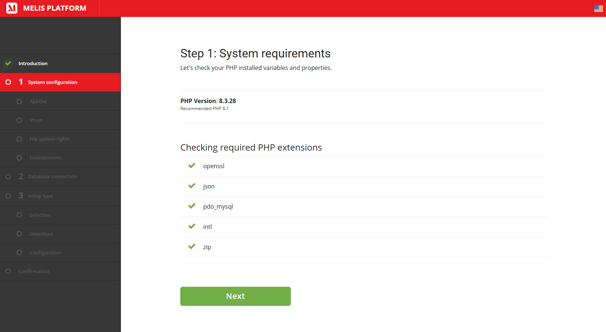

### Step 1.1: Apache setup
Tests the needed Apache modules — `mod_headers`, `mod_alias`, `mod_deflate`. A missing one shows a ⚠ with
*“Please enable all of the Apache modules displayed above for a better performance.”* (a warning, not a
blocker).

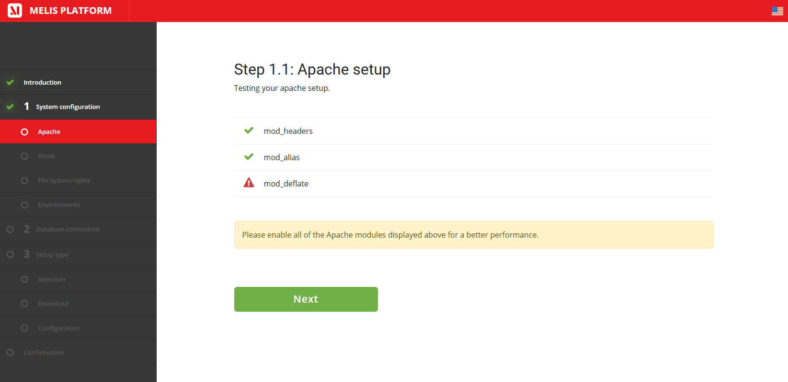

### Step 1.2: Vhost setup
Confirms the virtual host is wired: it reads the **Environment platform** (e.g. `local`) and the **Site
module** (e.g. `MelisDemoCms`) from your vhost env vars — proving `MELIS_PLATFORM` / `MELIS_MODULE` are set.

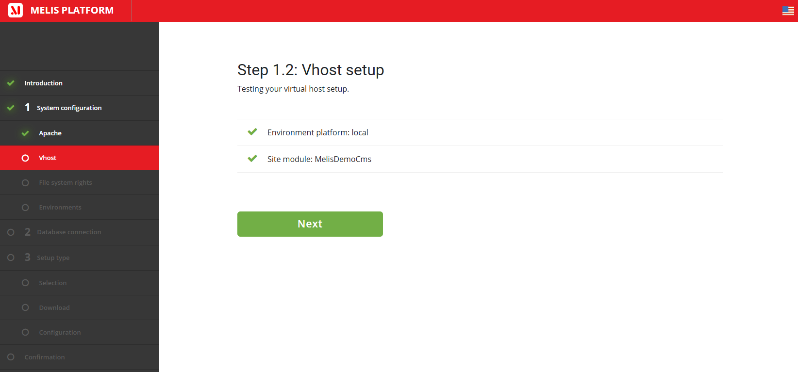

### Step 1.3: File system rights
Verifies every directory the platform must write to is **writable** — `config/`, `config/autoload/`,
`config/autoload/platforms/`, `module/MelisModuleConfig/` (+ `languages`, `config`), `module/MelisSites/`,
`data/`, `dbdeploy/` (+ `dbdeploy/data`), `public/`. All must be green to proceed.

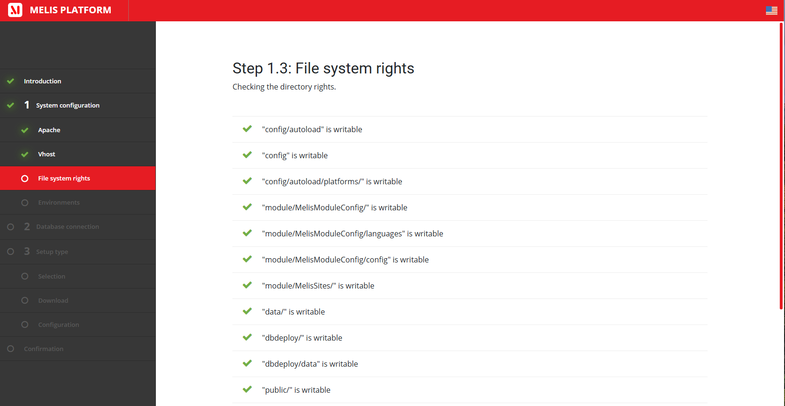

### Step 1.4: Environments
Defines your **environment(s)**. The current one (e.g. `local`) is shown with **Advance parameters** — *Email
sending* (enabled/disabled) and *Error reporting* (e.g. *Report all errors (E_ALL)*). **+ Add environment**
lets you declare additional platforms (staging/prod) up front.

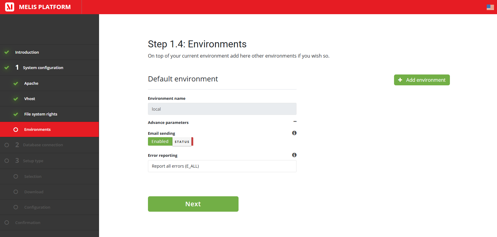

## A3. Step 2 — Database connection

Enter **Host**, **Database**, **Username**, **Password**, then **Test database connection**. *Next* stays
disabled until the test passes — so you can’t continue with a bad DB.

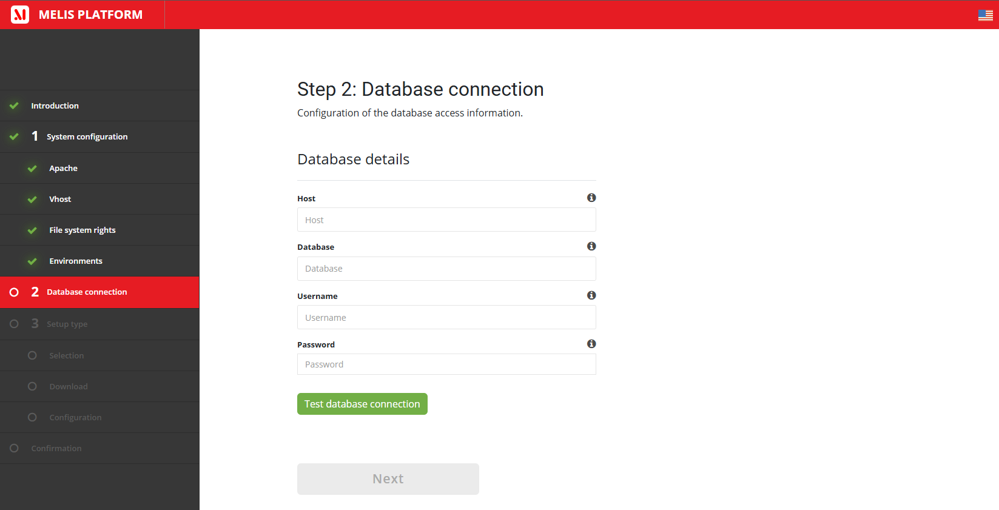

## A4. Step 3 — Setup type

### 3.1 Setup type and modules (Selection)
Choose **what kind of install** you want — four options (this is the big decision):

| Setup type | What it installs | For whom |
|---|---|---|
| **Core Platform only (MelisCore)** | MelisCore only — a back-office with user management + default tools, no CMS. | a dev environment for projects that don’t need a CMS. |
| **CMS platform with no site** | nothing pre-built (no module/folder/page) — you build the site from scratch. | advanced users / special requirements. |
| **CMS platform with new website** | a **site base**: a site module with its `Module.php`, config, a layout, a controller, a first action/view, and a first page in the site tree. | those already familiar with the Melis CMS site structure. |
| **CMS platform with demo site** | imports the **Melis Demo CMS** site as a working tutorial. | those **discovering** Melis Platform. |

Below that, **Install an additional Framework** (*Enable multi-framework coding? Yes/No*) lets you integrate
another framework alongside Melis.

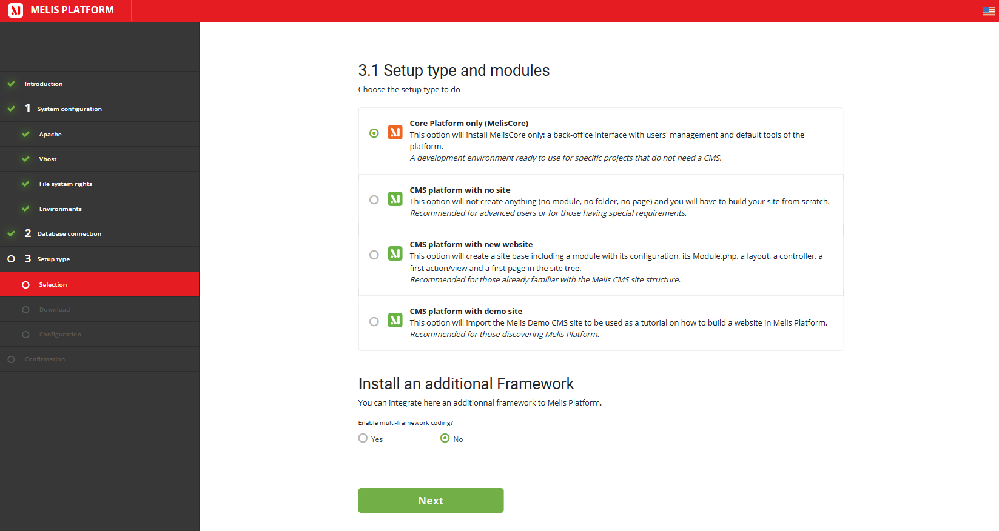

When a CMS option is chosen, you then pick the **Site to install** — *Melis Demo Cms* or *Melis Demo Cms Twig*
(the Twig variant demonstrates Twig as the templating engine) — and tick the **Modules to install** from a
versioned checklist (Melis Cms, Front, Engine, Cms News, Cms Slider, Prospects, Commerce, …, with a *Select
all*). The site’s required modules are pre-checked.

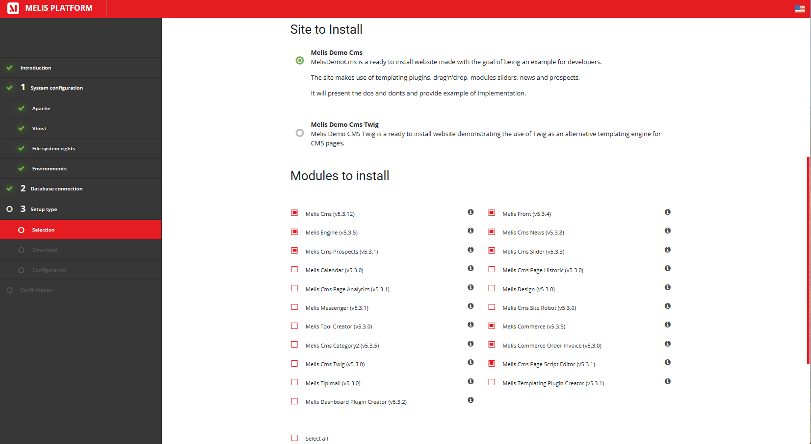

### Step 3.2: Modules / Download
The installer now does the heavy lifting and **streams a live log**: it runs **Composer** to download the
packages, **imports the tables** (*“Table from MelisCore has been imported successfully”*), and **activates**
the modules (*“Activated MelisEngine / MelisFront / MelisCore … Done”*). This can take a while.

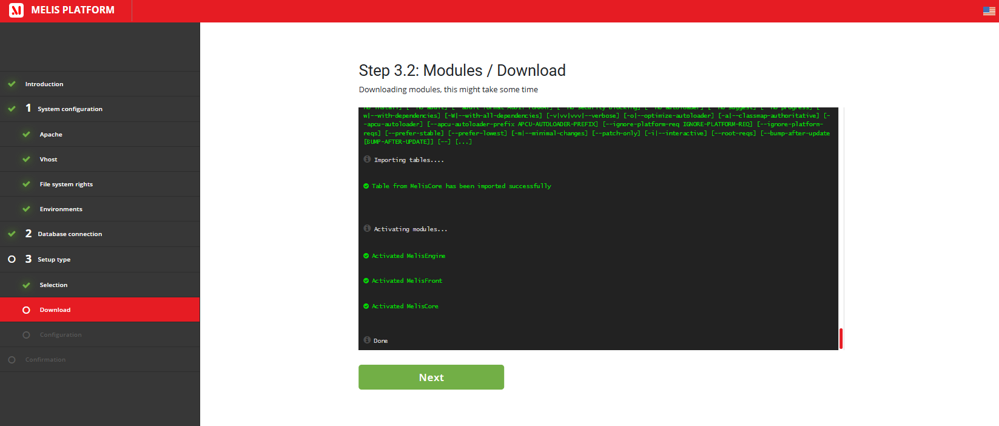

### Setup type / Configuration
Some modules need configuration before first use — shown as per-module tabs (e.g. **MelisCore**,
**MelisDemoCms**). The **MelisCore** tab is where you create the **first administrator**: *Login*, *Email*,
*Password* (+ confirm), *First name*, *Last name*.

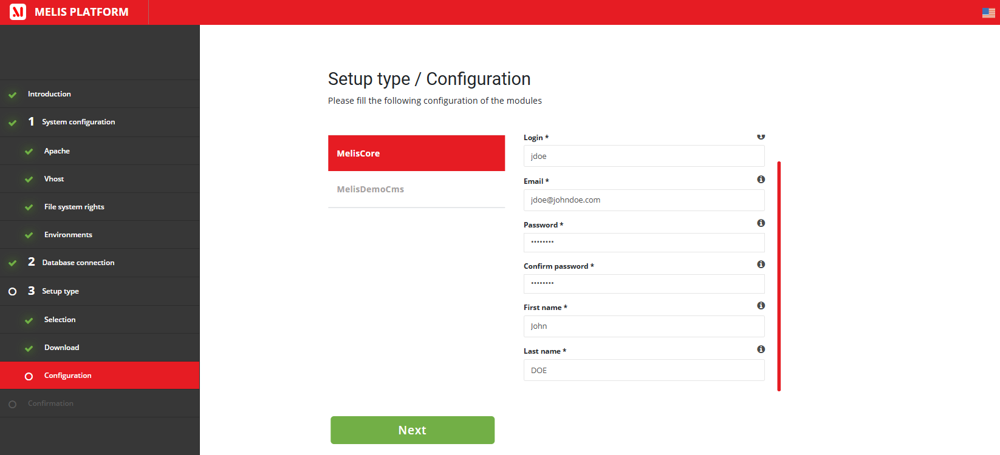

## A5. Confirmation

A final **Installation** screen — *“Validate and finish the setup of Melis Platform with configuration
provided.”* Press **Install** to commit. When it’s done you log in to the back office and start building.

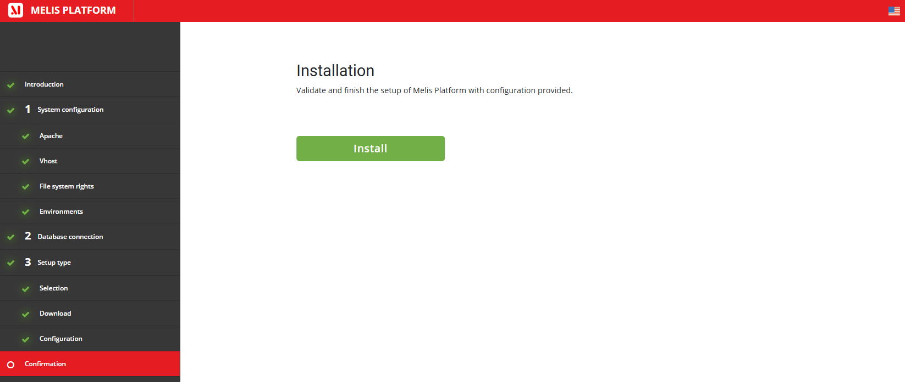

## A6. When you use it

Only at **initial setup** (or when re-provisioning an environment). Day-to-day you don’t touch the installer —
you manage modules from the back-office **Modules** tool (MelisComposerDeploy) instead.

---
---

# PART B — Technical Reference

## B1. Metadata & dependencies

| Item | Value |
|---|---|
| Package | `melisplatform/melis-installer` · category `core` · namespace `MelisInstaller\` · `melis-site: false` |
| Requires | `melisplatform/melis-core`, `melisplatform/melis-engine` (`^5.2`) |
| Orchestrates | **MelisComposerDeploy** (download), **MelisDbDeploy** (import tables), module activation, **MelisAssetManager** (assets) |

## B2. The wizard → controllers, services, forms

- **Controllers** (`src/Controller/`): `InstallerController` drives every step (system checks, DB test, setup
  type, download, configuration, install); `TranslationController` serves the installer’s own translations.
- **Services** (`src/Service/`):
  - **`InstallHelperService`** — the environment/DB checks: required-extension verification, the writable-path
    checks, `checkMysqlConnection()`, the DB adapter + raw-SQL bootstrap, and `isDbTableExists()` (so a
    half-finished install can be detected). Powers Steps 1 & 2.
  - **`MelisInstallerModulesService`** — module discovery & selection (mirrors AssetManager): all/vendor/user/
    sites/core modules, versions, and Composer paths. Powers the 3.1 checklist.
  - **`MelisInstallerConfigService`** / **`MelisInstallerTranslationService`** (+ `…ServiceInterface`) — config
    merge and translations *that work before MelisCore is fully available* (the wizard runs pre-install, so it
    carries its own `getItem` / `getFormMergedAndOrdered` / `getTranslationMessages` helpers). `AbstractService`
    is their shared base.
- **Forms** (`src/Form/`): factories for the language/web-option selects, text/select elements, and custom view
  helpers (`MelisFieldCollection`, `MelisFieldRow`) that render the wizard forms. **`MelisPasswordValidator`**
  (`src/Validator/`) enforces the admin-password policy on the Configuration step.

## B3. Install flow & orchestration

```
Step 1  System config   → InstallHelperService: PHP/extensions, Apache mods, vhost (MELIS_PLATFORM/MELIS_MODULE),
                          writable paths, environments
Step 2  Database        → InstallHelperService::checkMysqlConnection() (Next gated on success)
Step 3  Selection       → choose setup type (Core only | CMS no site | CMS new website | CMS demo site)
                          + site (Demo CMS / Demo CMS Twig) + module checklist (MelisInstallerModulesService)
        Download        → MelisComposerDeploy downloads packages → MelisDbDeploy imports tables → modules activated
        Configuration   → per-module config forms; MelisCore tab creates the admin user
Confirmation Install    → finalise; fires meliscore_install_create_new_user for the admin account
```

Two listeners (`src/Listener/`) hook the process: **`MelisInstallModuleConfigListener`** (module-config
handling during install) and **`MelisInstallerNewPlatformListener`** (new-platform/environment setup).

## B4. Quick code map

```
melis-installer/
├── composer.json                 → deps (core + engine), category core
├── config/                       → module.config.php, app.interface.php, app.forms.php, module.load.php
├── src/
│   ├── Controller/   InstallerController · TranslationController
│   ├── Service/      InstallHelperService · MelisInstallerModulesService · MelisInstallerConfigService
│   │                 · MelisInstallerTranslationService(+Interface) · AbstractService
│   ├── Form/         Factory/* · View/Helper/(MelisFieldCollection, MelisFieldRow)
│   ├── Validator/    MelisPasswordValidator
│   └── Listener/     MelisInstallModuleConfigListener · MelisInstallerNewPlatformListener
├── view/ · public/ · language/
└── etc/   MarketPlace + MelisAI/doc (this doc + ./images)
```

---

## Screenshot index

| File | Shows |
|---|---|
| `images/melisinstaller-introduction.png` | The welcome screen (3 milestones + *Let’s start*). |
| `images/melisinstaller-step1-requirements.png` | Step 1 — PHP version + required extension checks. |
| `images/melisinstaller-step1-apachesetup.png` | Step 1.1 — Apache module checks (headers/alias/deflate). |
| `images/melisinstaller-step1-setupvhost.png` | Step 1.2 — Vhost: environment platform + site module. |
| `images/melisinstaller-step1-filerights.png` | Step 1.3 — writable-directory checks. |
| `images/melisinstaller-step1-environments.png` | Step 1.4 — environment(s) + email/error-reporting params. |
| `images/melisinstaller-step2-db.png` | Step 2 — Database connection form + test. |
| `images/melisinstaller-step3-modules.png` | 3.1 — the four setup types + multi-framework toggle. |
| `images/melisinstaller-step3-modules-2.png` | 3.1 — site to install + the modules checklist. |
| `images/melisinstaller-step3-download.png` | 3.2 — live Composer download / table import / activation log. |
| `images/melisinstaller-step3-configuration.png` | Configuration — per-module tabs + the admin-user form. |
| `images/melisinstaller-step4-confirmation.png` | Confirmation — the final *Install* button. |

*Document for AI consumption (MelisAI MCP) — `melisplatform/melis-installer`. Part A = functional; Part B =
technical. Part of the MelisCore platform foundation. Last reviewed 2026-06-10.*
